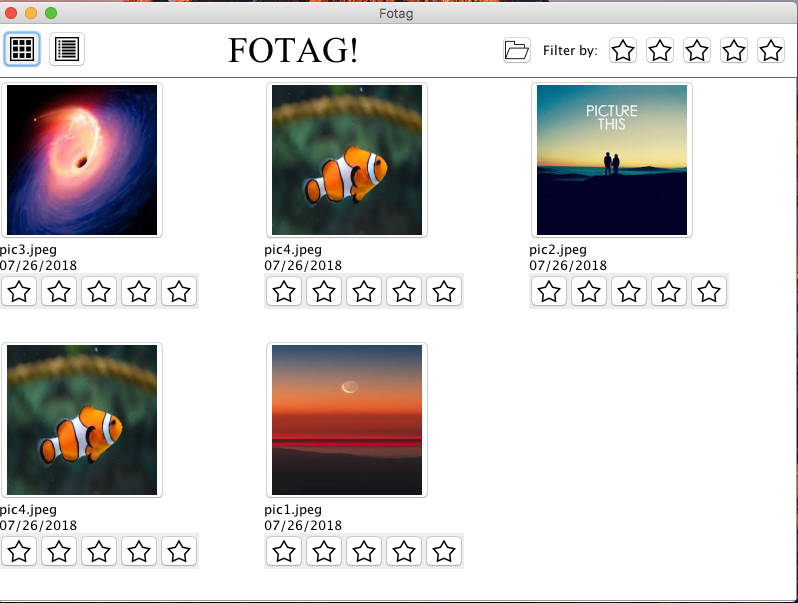
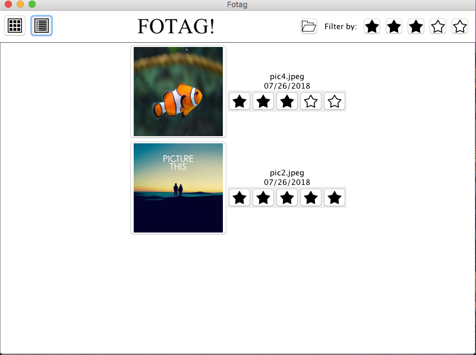

# Fotag

Fotag is an application which allows users to display a set of images in both List and Grid views, zoom-in to view a single image, rate images, and filter the list of images by rating.

## Dev Environment:

OS: Mac 
JAVA version: 10.0.1

## Instruction

1.Click the same star to clear the filter and rating: 
2.Click close button to exit 

## Screen shots

